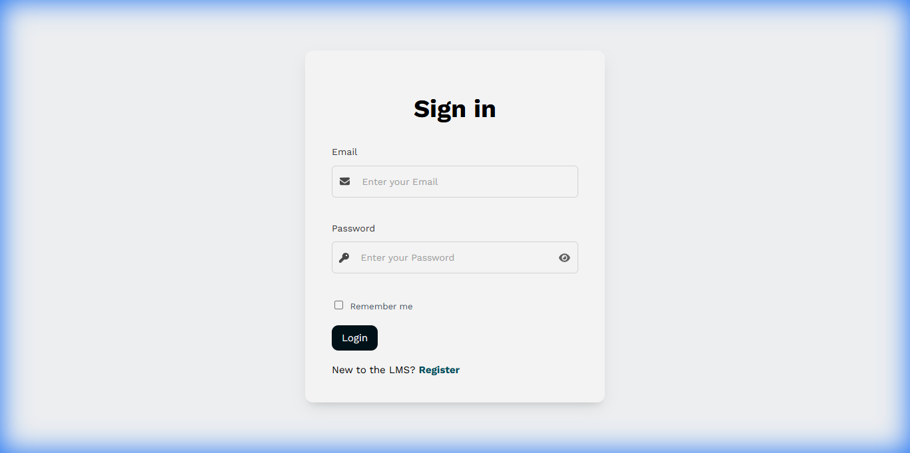
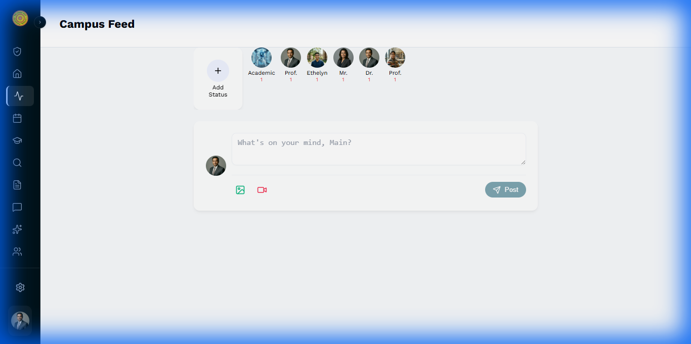

# 📚 Learning Management System (LMS)

[](https://laravel.com)
[](https://reactjs.org)
[](https://tailwindcss.com)

A premium, modern Learning Management System built with **Laravel**, **React**, and **Inertia.js**. Featuring a sophisticated "Professional" UI theme with glassmorphism and integrated AI capabilities.

Developed by **Kalhara** and **Heshan**.

---

## 🖼️ Visual Preview

### 🔒 Secure & Professional Login


### 📊 Sophisticated Dashboard


### 📱 Interactive Campus Feed


---

## ✨ Key Features

*   💎 **Premium UI/UX** – Centralized color tokens, glassmorphism, and responsive design for a high-end feel.
*   🔑 **Security First** – Encrypted user data and Multi-Factor Authentication (2FA) for all account types.
*   🤖 **AI-Powered Learning** – Integrated **Academic AI Assistant** for real-time support and administration.
*   🖼️ **Realistic Seeding** – AI-generated professional profile pictures for all seeded system users.
*   👩‍🎓 **Role-Based Access** – Granular permissions for Admins, Lecturers, and Students.
*   💬 **Real-time Interaction** – Social campus feed with status updates (Stories), reactions, and sharing.
*   📂 **Academic Management** – Course modules, assignment grading, and comprehensive student tracking.

---

## 🛠️ Tech Stack

*   **Backend:** Laravel 12.x (PHP 8.2+)
*   **Frontend:** React (hooks/functional components), Inertia.js, Vite
*   **Styling:** Custom CSS Modules & CSS Variables (Centralized System)
*   **Database:** MySQL (Supports SQLite)
*   **Real-time:** Pusher / Laravel Echo
*   **Assistance:** Gemini AI Integration

---

## 🚀 Installation & Setup

### 🔹 Prerequisites
*   [PHP 8.2+](https://www.php.net/)
*   [Composer](https://getcomposer.org/)
*   [Node.js & npm](https://nodejs.org/)
*   [MySQL](https://dev.mysql.com/)

### 🔹 One-Click Setup (Recommended)
**Windows (PowerShell):**
```powershell
.\setup.ps1
```
**Linux / macOS:**
```bash
chmod +x setup.sh && ./setup.sh
```

### 🔹 Manual Setup
1. **Clone & Install**
   ```bash
   git clone https://github.com/sunhesh12/lms-new-project.git
   cd lms-new-project
   composer install && npm install
   ```
2. **Environment**
   ```bash
   cp .env.example .env
   php artisan key:generate
   ```
   *Update your `.env` with DB credentials and Gemini API Key.*
3. **Database & Assets**
   ```bash
   php artisan migrate --seed
   php artisan storage:link
   npm run build
   ```

---

## 👥 Local Development Accounts
Access the system using these pre-seeded credentials:
*   **Admin:** `admin@lms.com` | `admin123`
*   **Test User:** `abc@gmail.com` | `password123`

---

## 🤝 Project Team
*   **Kalhara** – Backend Architecture & Security
*   **Heshan** – UI Engineering & Frontend Systems

---

## 📜 License
This project is licensed under the MIT License.
